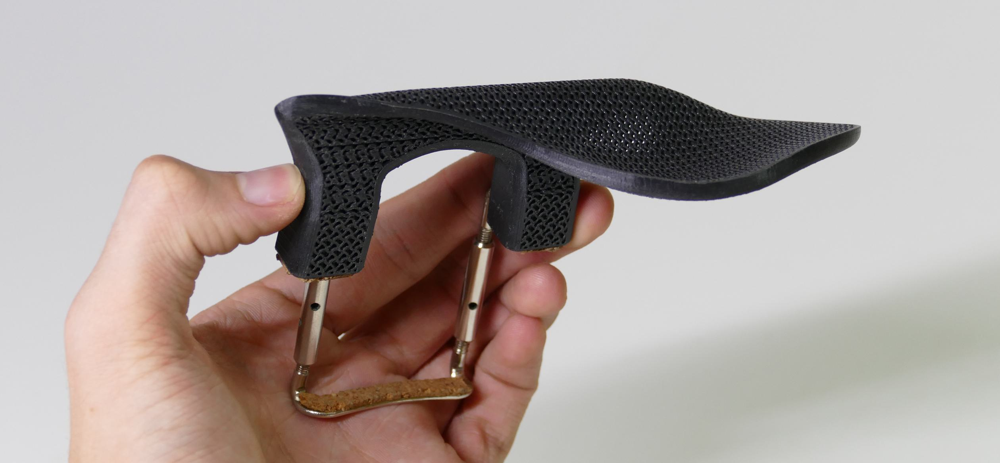
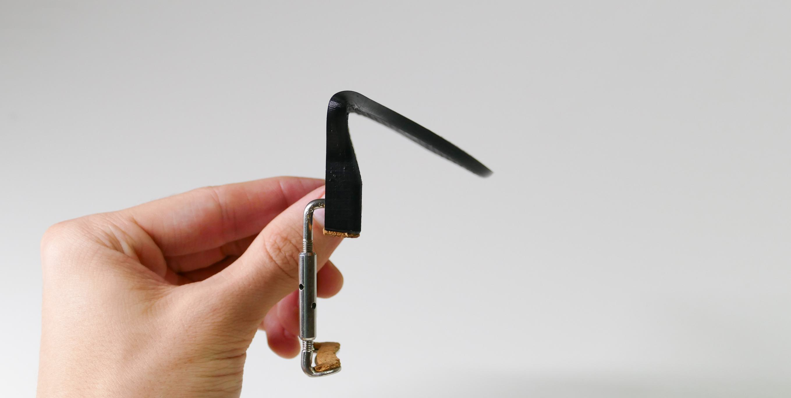
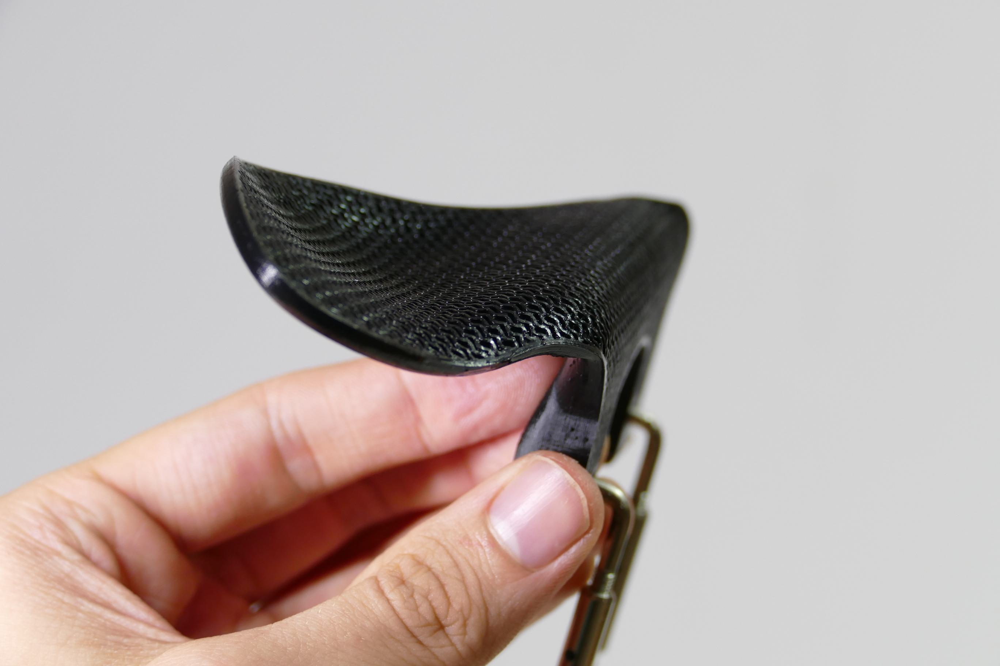

# formRest
A violin chinrest that utilizes a novel moldable construction for enhanced comfort. 

## Overview 

### At 140 degrees fahrenheit the Form chinrest becomes highly moldable. Due to its porous construction, the rest can easily support compound curvature, agnostic of axis, and will capture the formed shape when hardened. The rest is available in three heights, can be infinitely remolded with reheating, and can be 3D printed at home provided compatable, standard mounting hardware. 

## Project Files
### [3D Models](https://www.thingiverse.com/thing:6181987)

### [Photo Gallery](/images/) 

## Documentation

### How To Print

### [Video tutorial](https://youtu.be/1bcNrPzV9mo)

Attached in Thingiverse are two models Slant and Straight, each in three heights. After downloading your preference ofmodel with chosen height variant, import it into Prusaslicer1 .

‍First, orient the model with the planar side on the build plate. Right-click the model and select Split > To parts.

‍Using the menu on the right, select the blocky protrusion. Right click on the name, Change type > Modifier. Then, right click on the name and select Layers and Perimeters. In the menu below, remove all top, bottom, and perimeters.

Right click on the parent model -- such that all bodies are selected -- and select Height Range Modifier. In the menu below, set the range from 0 - 2 mm. Right click on the range, Add settings > Advanced and select Length of the infill anchor and Maximum length of the infill anchor. In the menu below, set the values to 2 and 10, respectively.

‍In the right panel, locate the main chinrest section — not the body previously modified. Right click and select Layers and Perimeters. In the menu below, remove all top and bottom layers and confirm Perimeters is set to 1 or 2.

In the Infill tab Print Settings window, set the Fill density to 40% and Fill pattern to Gyroid. Then, set Length of the infill anchor and Maximum length of the infill anchor to 0. In the Layers and perimeters tab, set the layer height as low as possible; recommended is .05 mm. Ensure you are printing with PLA, PVB, or a plastic with similar thermal characteristics.

### Hardware and Assembly

After the body of the Form Rest is printed, two other parts are required for functionality: cork padding on the rest's feet and the standard metal mounting bracket. If you are only building one rest, the least wasteful and most cost-effective solution is to purchase a regular chinrest and remove the parts of interest. If building many Forms, however, 1 mm adhesive cork sheets and sets of chinrest hardware can be purchased.

A standard chinrest, such as [this](#https://www.amazon.com/Soarun-Violin-Chinrest-Standard-Bracket/dp/B073PX8FXF/ref=sr_1_4?crid=G0G21C0Z707R&keywords=full+size+violin+chinrest&qid=1689226913&sprefix=full+size+violin+chinrest%2Caps%2C88&sr=8-4) option from Amazon, will work well to provide the necessary parts; after removing the mounting hardware and transferring the cork pads with a knife, the Form will be completed with less than $10 (not including printing). Alternatively, for $20 several mounting brackets and multiple sheets of 1 mm adhesive cork can be purchased, though you will have left over supplies.

### How to Form

#### Achieving an ideal curvature requires patience, creativity, and a thorough understanding of your anatomy as well as your needs and movement as a player. Following instructions will not produce the optimal result for everyone, though they are a recommended starting point. ‍

‍Analysis Look at your current chinrest; what can be improved? Examine the form and curvature; use a mirror to observe how your jaw interacts with the geometry. Where should material be added or removed, how should the angles change?
‍The more precise your understanding and ideas, the easier this process will become; the time taken to reach a comfortable shape will be reduced, and the final product will be more exact.

‍Preparation It is recommended that heating is done using a hairdryer heating can be applied more precisely. Some dryers may exceed the necessary temperatures for molding so begin using a low temperature setting. Alternatively, hot water can be used. Using a thermometer, monitor the water temperature. 140º should be used for gross adjustments to shape, while 150º should be used for adjusting localized areas or creating specific creases.
Keep in mind: a higher temperature allows for more freedom, though undesired results are easier to produce.
‍
‍Additionally, place a rag or towel next to the stove top. After softening the rest, it should be placed briefly on the absorbent surface to remove water. The rest should be allowed to air dry overnight before placing on the instrument.
‍In the case of returning the Form to its default position, water will produce better results. ‍‍

The following bending procedure follows the above diagram. A **Primary Bend** (blue) is created to establish the main rest curve; a **Secondary Bend** (orange) is created to support the jaw; and **Edge Adjustments** (green) are added to round sharp edges.

**‍Primary Bend** Place the planar face of the rest on a flat surface, then bend the legs forward until a relative angle of greater than 90º is achieved. The sharper the angle becomes, a more aggressive lip behind the jaw will be created.  ‍

**‍‍Secondary Bend** Soften the unbent portion of the rest, then create a secondary bend to create a cup shape. The angle of this step is dependent on your playing position.
*Forming should be easy and require very little effort; if this is not the case, try heating for longer or carefully increase the temperature.*

**‍Edge Adjustments** Using a higher heat, soften preferred edges and round them to a desired degree.

‍‍**Mount and Repeat** Perfection demands multiple trials – continue experimenting until you are satisfied; feel free to start from scratch.SS